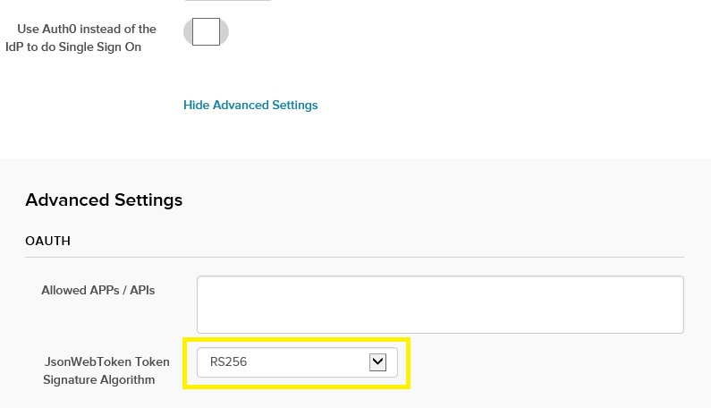

# Pre-release warning

This is written while I'm working with ASP.net 5 beta 3. Things may change.

# Stuff you should have already done

* Setup an Auth0 dev account. It's really easy. Go do it.
* Followed the instructions Auth0's QuickStart to setup your client app, or downloaded their started app.

# Setting up ASP.net 5

My first issue was that I was looking for a Jwt or OpenIdConnect middleware like the Auth0 quickstart says for old OWIN apps. Looks like that's been merged into the plain old Microsoft.AspNet.Security.OAuthBearer NuGet package.

## Step 1 - Add Nuget package

In project.json the add Nuget package to your dependencies:

    "dependencies": {
    	...
        "Microsoft.AspNet.Security.OAuthBearer": "1.0.0-beta3"
    }

## Step 2 - Set it up in setup.cs

    public void Configure(IApplicationBuilder app, IHostingEnvironment env, ILoggerFactory loggerfactory)
    {
        app.UseOAuthBearerAuthentication(o =>
        {
            o.Authority = "YOUR AUTH0 DOMAIN.auth0.com";
            o.Audience = "YOUR CLIENT ID GOES HERE";
        });

    	//everything else from the template

    }

## Step 3 - Change the JWT signing algorithm

FYI, This step may not be needed once everything is RTM, but it's also the one that hung me up for a while.

Go to your Auth0 admin UI. Open the settings tab for the app you've created, and set the JsonWebToken Token Signature Algorithm to RS256.

